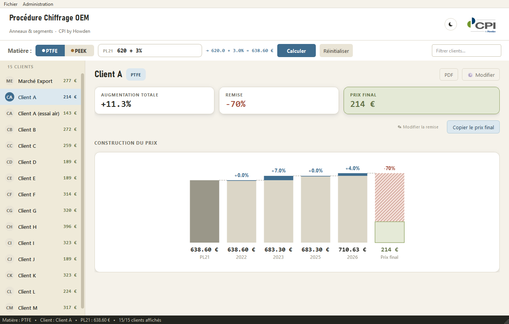

*[Read this in English](README.en.md)*

# Chiffrage OEM

Application desktop (PyQt6, Windows) de calcul de prix unitaires OEM pour des
pièces industrielles vendues à différents clients, développée pour **CPI
Howden** (anciennement CPI Liard).

> **Note portfolio** — ce dépôt est une version publique du projet : le
> code métier est identique à celui utilisé en production, mais les données
> de démonstration (clients, taux, remises dans `DEFAULT_DATA`) sont
> **fictives**. Les vraies données commerciales de CPI Howden ne sont ni
> présentes ni accessibles depuis ce dépôt (fichier `chiffrage_data.json`
> volontairement exclu du dépôt, voir `.gitignore`).



## Documentation

Dossier de spécifications complet (principe de calcul, architecture, revue de
fiabilité/sécurité, captures d'écran) : [FR](docs/Chiffrage_OEM_-_Dossier_de_specifications.pdf) ·
[EN](docs/Chiffrage_OEM_-_Dossier_de_specifications_EN.pdf).

## Principe métier

On part d'un prix catalogue de référence (« PL21 ») saisi par l'utilisateur,
puis on applique successivement :

1. les taux d'augmentation annuels négociés avec chaque client (par année,
   par matière — PTFE ou PEEK),
2. la remise commerciale négociée avec ce client,

```
prix_final = ceil( PL21 × ∏(1 + taux_année) × (1 + remise) )
```

Le résultat est arrondi au centime supérieur.

## Fonctionnalités

- Sélection matière (PTFE/PEEK), calcul instantané, historique des calculs
- Visualisation en cascade (waterfall) de l'effet de chaque année + remise
- Gestion admin protégée par mot de passe (ajout/suppression de clients et
  d'années, modification des taux et remises)
- Export PDF du détail de calcul, export Excel (optionnel, si `openpyxl`
  installé), copie rapide dans le presse-papiers
- Journal d'audit des actions admin, sauvegarde atomique des données,
  récupération automatique en cas de fichier corrompu

## Sécurité

- Mot de passe admin haché et salé (PBKDF2-HMAC-SHA256), comparaison à temps
  constant (`hmac.compare_digest`)
- Aucun mot de passe par défaut codé en dur : à la toute première
  utilisation, un mot de passe est **généré aléatoirement** et affiché une
  seule fois à l'écran
- Ralentissement progressif après des tentatives de connexion admin échouées
- Toute anomalie sur les données d'authentification (fichier altéré
  manuellement) est tracée dans le journal d'audit

## Stack technique

- Python 3.12, PyQt6 (interface), openpyxl (export Excel, optionnel)
- Empaquetage en exécutable Windows via PyInstaller (`build.ps1`)
- Installeur via Inno Setup (`installeur_chiffrage.iss`)
- Release automatisée : build + tag + GitHub Release (`release.ps1`)

## Lancer le projet

```bash
pip install PyQt6 openpyxl
python chiffrage_oem.py
```

Au premier lancement, un jeu de données de démonstration fictif est créé et
un mot de passe admin est généré puis affiché à l'écran.

---

Créé par Dylan Carlier.
